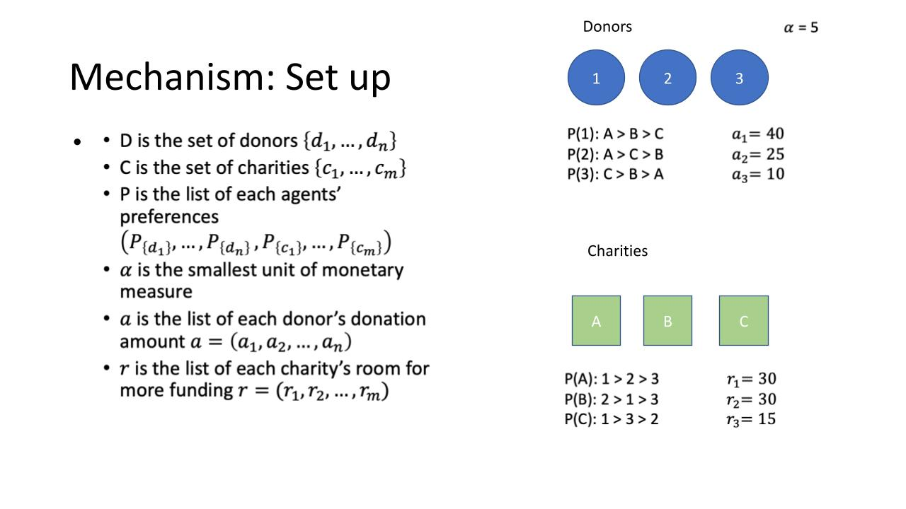

# CharityDonorMatching

Developed in conjunction with PHD research here at Vanderbilt University, the Charity Donor Matching Algorithm is an object-oriented program based around the idea that charitable donations are not always distributed efficiently among charities. Taking in a certain number of charities, the preferred budget for each, the funds distributed by donors, and the preferred charities of donors, the program calculates the most efficient distributions of donations based on an algorithm provided by the PHD student studying this dilemma. Click the icon.

Donor Class : 
 Class Attributes 
  self.symbol = symbol
  - The name or symbol of the donor used for identification 
  self.money
  - The total funds that the donor is willing to donate 
  self.preferences 
  - A dictionary containing the charities the donor is willing to donate to with the               element being the preference number.
  self.moneyspent
  - Keeps track of total funding already distributed 
  self.ranking
  - Keeps track of the Donor's ranking in the eyes of the charity 
  
Charity Class : 
 Class Attributes
  self.symbol
  - The name or symbol of the charity used for identification 
  self.capacity 
  - total capactiy of funding
  self.funding
  - current received funding
  self.preferences
  - A dictionary containing the donor the charity is willing to donate to with the               element being the preference number.
  
Algorithm : 

This project was done in conjucntion with a PHD student's research, and they explain the algortihm beautifully, so I'll let them take it away. 
Credit to Steven Hamilton 
steven.d.hamilton@vanderbilt.edu

.pptx.jpg)
.pptx.jpg)
.pptx.jpg)
.pptx.jpg)
.pptx.jpg)

  
